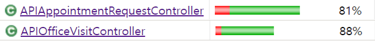
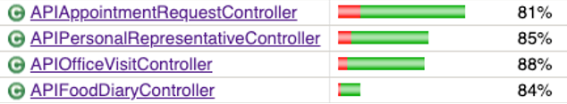
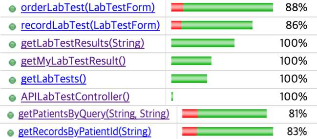
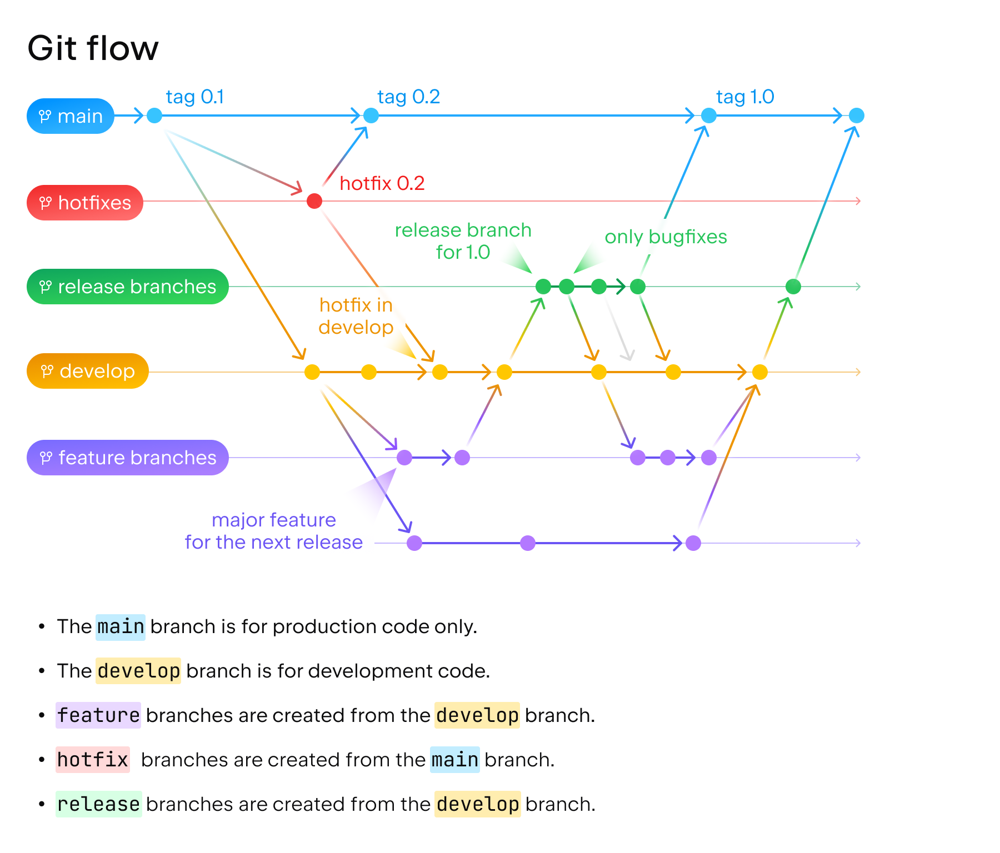

# iTrust2


## Team2 iTrust2 Project

### Members
| GitLab ID | Name |Student ID|    Contact  | Cell No.  | etc. |
|:---:|:---:|:---:|:-------------:|:-----:|:---:|
| 2021147561 | Kim, Yeong Seo | 2021147561 | 010-9494-7646 | Cell 1 | Experienced in Java |
| 2021147598 | Park, Seungho  | 2021147598 | 010-4076-6939 | Cell 1 | Experienced in Java |
| Soeun | Uhm, Soeun | 2019143073 | 010-9887-7683 | Cell 1 | Experienced in Java |
| claire | Kim, Jueun | 2021147510 | 010-7213-7394 | Cell 2 | Experienced in Java |
| Yoon | Yoon, Jongyoon | 2021147599 | 010-8300-1365 | Cell 2 | Experienced in Java |
| 2019145019| Jang, Yeonghwan | 2019145019 | 010-3103-3840 | Cell 2 | Experienced in Java |
| KangMinYong | Kang, Minyong | 2017147513 | 010-3041-1621 | Cell 3 | Experienced in Java |
| 2019145010 | Lim, Yewon | 2019145010 | 010-5446-2109 | Cell 3 | Experienced in Java |
| 2021147593 | Noh, GyuMin | 2021147593 | 010-7141-2273 | Cell 3 | Experienced in Java |

### Project Rules

1. **Communication is Key**: Maintain open communication channels through Slack, emails, or regular standup meetings.
2. **Task Assignment**: Use project management tools (e.g., Trello, Asana) to assign tasks clearly and keep track of progress.
3. **Code Review & Merge**: All code must go through a review process before merging into the main branch.
4. **Documentation**: Keep documentation up-to-date to ensure smooth onboarding and knowledge transfer.
5. **Coding Standards**: Adhere to agreed-upon coding standards and naming conventions for consistency across the codebase.
6. **Branch Protection**: Protect important branches (`main`, `develop`) to prevent direct pushes and require code reviews for merging.
7. **Testing Protocol**: Ensure comprehensive test coverage for new features and bug fixes; automate where possible.
8. **Meeting Etiquette**: Start meetings on time, prepare an agenda, and ensure active participation from all team members.
9. **Version Control**: Use descriptive commit messages and avoid committing large, unrelated changes in a single commit.
10. **Feedback Loop**: Encourage a culture of feedback and improvement, both within the team and from stakeholders or end-users.


## User Case Progress

| User Case      | Cell | Task Assignment | API Documentation | Backend API Completion | Frontend UI Completion | Integration & Testing |
| --------------- |--------------- | --------------- | ----------------- | ---------------------- | ---------------------- | --------------------- |
| UC 21      | Cell 1 | ✅ | ✅ | ✅ | ✅ | ✅ |
| UC 22      | Cell 1 | ✅ | ✅ | ✅ | ✅ | ✅ |
| UC 16      | Cell 2 | ✅ | ✅ | ✅ | ✅ | ✅ |
| UC 19      | Cell 2 | ✅ | ✅ | ✅ | ✅ | ✅ |
| UC 15      | Cell 3 | ✅ | ✅ | ✅ | ✅ | ✅ |
| UC 23 (new)| Cell 3 | ✅ | ✅ | ✅ | ✅ | ✅ |

## UC API Documentation
| User Case      | Cell | Document Link |
| --------------- |--------------- | --------------- |
| UC 21      | Cell 1 | [API Document](./docs/apis/UC21.md) |
| UC 22      | Cell 1 | [API Document](./docs/apis/UC22.md) |
| UC 16      | Cell 2 | [API Document](./docs/apis/UC16.md) |
| UC 19      | Cell 2 | [API Document](./docs/apis/UC19.md) |
| UC 15      | Cell 3 | [API Document](./docs/apis/UC15.md) |
| UC 23 (new)| Cell 3 | [API Document](./docs/apis/UC23.md) |


## Test Coverage
Achieved over 80% test coverage across all UCs implemented.

<br/>


<br/>



<br/>


## Regular Meeting
11 PM, Tue, 1hour.  
Link: https://meet.google.com/ocp-naww-bnv

| Meeting Date | Meeting Purpose | Participants | Document Link                                                                                          | 담당 Cell | 
|--------------|-----------------| --------------- |--------------------------------------------------------------------------------------------------------| ------------ |
| 2023-10-17   | Iter1 대비        | Cell 1, 2, 3 | [Meeting Document](https://34.64.100.199/team2/itrust2/-/blob/develop/docs/regular_meetings/231017.md) | Cell 1|
| 2023-10-24   | Iter1 대비        | Cell 1, 2, 3 | [Meeting Document](https://34.64.100.199/team2/itrust2/-/blob/develop/docs/regular_meetings/231024.md) | Cell 1|
| 2023-11-07   | Iter2 대비        | Cell 1, 2, 3 | [Meeting Document](./docs/regular_meetings/231107.md)                                                  | Cell 2|
| 2023-11-14   | Iter2 대비        | Cell 1, 2, 3 | [Meeting Document](./docs/regular_meetings/231114.md)                                                  | Cell 2|
| 2023-11-28   | Iter3 대비        | Cell 1, 2, 3 | [Meeting Document](./docs/regular_meetings/231128.md)                                                  | Cell 3|
| 2023-12-05   | Iter3 대비        | Cell 1, 2, 3 | [Meeting Document](./docs/regular_meetings/231205.md)                                                  |Cell 3|


### Meetings
| Meeting Date | Meeting Purpose            | Participants           | Document Link                                |
|--------------|----------------------------|------------------------|----------------------------------------------|
| 2023-10-28| UC 읽어보고 선정하기 | Cell 1 (김영서, 박승호, 엄소은) | [Meeting Document](https://34.64.100.199/team2/itrust2/-/blob/develop/docs/meetings/team1.md?ref_type=heads#anchor-1028)|
| 2023-10-30   | Cell2 포지션 분배 및 개발 계획       | Cell 2 (김주은, 윤종윤, 장영환) | [Meeting Document](./docs/meetings/team2.md) |
| 2023-11-04   | Cell3 첫 미팅 및 구조 파악         | Cell 3 (강민용, 임예원, 노규민) | [Meeting Document](./docs/meetings/team3.md) |
| 2023-11-04   | 포지션 재분배 및 Git 숙지           | Cell 2 (김주은, 윤종윤, 장영환) | [Meeting Document](./docs/meetings/team2.md) |
| 2023-11-05| DB 칼럼 공부하기 | Cell 1 (김영서, 박승호, 엄소은) | [Meeting Document](https://34.64.100.199/team2/itrust2/-/blob/develop/docs/meetings/team1.md?ref_type=heads#anchor-115)|
| 2023-11-08   | UC15 필요한 기능에 대한 논의         | Cell 3 (강민용, 임예원, 노규민) | [Meeting Document](./docs/meetings/team3.md) |
| 2023-11-09   | UC19 API 명세 작성 및 개발 계획 브리핑 | Cell 2 (김주은, 윤종윤, 장영환) | [Meeting Document](./docs/meetings/team2.md) |
| 2023-11-11| 개발관련 오류 논의 | Cell 1 (김영서, 박승호, 엄소은) | [Meeting Document](https://34.64.100.199/team2/itrust2/-/blob/develop/docs/meetings/team1.md?ref_type=heads#anchor-1111)|
| 2023-11-13   | UC19 FE BE간 개발 상황 공유       | Cell 2 (김주은, 윤종윤, 장영환) | [Meeting Document](./docs/meetings/team2.md) |
| 2023-11-13 | 기능별 권한 확인하기 | Cell 1 (김영서, 박승호, 엄소은) | [Meeting Document](https://34.64.100.199/team2/itrust2/-/blob/develop/docs/meetings/team1.md?ref_type=heads#anchor-1113)|
| 2023-11-15   | UC23 필요한 기능에 대한 논의         | Cell 3 (강민용, 임예원, 노규민) | [Meeting Document](./docs/meetings/team3.md) |
| 2023-11-15   | eclipse Build 이슈 해결        | Cell 2 (김주은, 윤종윤, 장영환) | [Meeting Document](./docs/meetings/team2.md) |
| 2023-11-16 | UC 21 구현 | Cell 1 (김영서, 박승호, 엄소은) | [Meeting Document](https://34.64.100.199/team2/itrust2/-/blob/develop/docs/meetings/team1.md?ref_type=heads#anchor-1116)|
| 2023-11-18   | UC15, UC23 API 문서 작성       | Cell 3 (강민용, 임예원, 노규민) | [Meeting Document](./docs/meetings/team3.md) |
| 2023-11-18   | UC19 API 기능 설명 및 수정        | Cell 2 (김주은, 윤종윤, 장영환) | [Meeting Document](./docs/meetings/team2.md) |
| 2023-11-18 | FE, BE 형식 맞추기 | Cell 1 (김영서, 박승호, 엄소은) | [Meeting Document](https://34.64.100.199/team2/itrust2/-/blob/develop/docs/meetings/team1.md?ref_type=heads#anchor-1118)|
| 2023-11-20   | UC15 개발 및 Test 작성 완료       | Cell 3 (강민용, 임예원, 노규민) | [Meeting Document](./docs/meetings/team3.md) |
| 2023-11-20   | UC19 이슈 해결 및 발표 준비         | Cell 2 (김주은, 윤종윤, 장영환) | [Meeting Document](./docs/meetings/team2.md) |
| 2023-11-20 | API 테스트 이슈 공유 | Cell 1 (김영서, 박승호, 엄소은) | [Meeting Document](https://34.64.100.199/team2/itrust2/-/blob/develop/docs/meetings/team1.md?ref_type=heads#anchor-1120)|
| 2023-11-22 | UC22 개발 계획 | Cell 1 (김영서, 박승호, 엄소은) | [Meeting Document](https://34.64.100.199/team2/itrust2/-/blob/develop/docs/meetings/team1.md?ref_type=heads#anchor-1122)|
| 2023-11-24   | UC16 역할 분담 및 개발 계획         | Cell 2 (김주은, 윤종윤, 장영환) | [Meeting Document](./docs/meetings/team2.md) |
| 2023-11-24 | FE 관련 화면 오류 | Cell 1 (김영서, 박승호, 엄소은) | [Meeting Document](https://34.64.100.199/team2/itrust2/-/blob/develop/docs/meetings/team1.md?ref_type=heads#anchor-1124)|
| 2023-11-28   | UC23 개발 계획 수립 및 개발 시작      | Cell 3 (강민용, 임예원, 노규민) | [Meeting Document](./docs/meetings/team3.md) |
| 2023-11-29   | UC16 API 개발 이슈 공유 및 해결     | Cell 2 (김주은, 윤종윤, 장영환) | [Meeting Document](./docs/meetings/team2.md) |
| 2023-12-01   | UC23 개발 및 Test 작성 완료       | Cell 3 (강민용, 임예원, 노규민) | [Meeting Document](./docs/meetings/team3.md) |
| 2023-12-01 | BE, FE 관련 오류 해결 | Cell 1 (김영서, 박승호, 엄소은) | [Meeting Document](https://34.64.100.199/team2/itrust2/-/blob/develop/docs/meetings/team1.md?ref_type=heads#anchor-1201)|
| 2023-12-03   | UC16 개발 상황 공유 및 이슈 해결      | Cell 2 (김주은, 윤종윤, 장영환) | [Meeting Document](./docs/meetings/team2.md) |
| 2023-12-05   | UC16 API 작동 문제 해결          | Cell 2 (김주은, 윤종윤, 장영환) | [Meeting Document](./docs/meetings/team2.md) |
| 2023-12-07 | 테스트 코드 이슈 | Cell 1 (김영서, 박승호, 엄소은) | [Meeting Document](https://34.64.100.199/team2/itrust2/-/blob/develop/docs/meetings/team1.md?ref_type=heads#anchor-1207)|
| 2023-12-08   | UC16 테스트코드 문제 해결           | Cell 2 (김주은, 윤종윤, 장영환) | [Meeting Document](./docs/meetings/team2.md) |

## Git Flow

We follow a simplified Git flow process:

### Branching Strategy
- `main`: Production-ready code
- `develop`: Integration branch for ongoing development
- Feature branches: Begin with `feature/` prefix (e.g., `feature/team1-UC21-FE`)

### Workflow
1. **Start with `develop`**: Create feature branches from the `develop` branch.
2. **Work on Features**: Develop new features or fix issues in feature branches.
3. **Pull Requests**: Submit pull requests to merge feature branches into `develop`.
4. **Code Review**: Team members review code, suggest changes if necessary.
5. **Merge to `develop`**: After approval, merge into the `develop` branch.
6. **Release**: Periodically merge `develop` into `main` for stable releases.




**Git flow**
- [Git flow 참고 영상](https://youtu.be/EV3FZ3cWBp8)

**Commit Convention**
- [Commit Convention 참고 자료](https://velog.io/@shin6403/Git-git-%EC%BB%A4%EB%B0%8B-%EC%BB%A8%EB%B2%A4%EC%85%98-%EC%84%A4%EC%A0%95%ED%95%98%EA%B8%B0)
```
# 제목은 최대 50글자까지 아래에 작성: ex) Feat: Add Key mapping  
# 본문은 아래에 작성  
# 꼬릿말은 아래에 작성: ex) Github issue #23  

# --- COMMIT END ---  
#   <타입> 리스트  
#   feat        : 기능 (새로운 기능)  
#   fix         : 버그 (버그 수정)  
#   refactor    : 리팩토링  
#   design      : CSS 등 사용자 UI 디자인 변경  
#   comment     : 필요한 주석 추가 및 변경  
#   style       : 스타일 (코드 형식, 세미콜론 추가: 비즈니스 로직에 변경 없음)  
#   docs        : 문서 수정 (문서 추가, 수정, 삭제, README)  
#   test        : 테스트 (테스트 코드 추가, 수정, 삭제: 비즈니스 로직에 변경 없음)  
#   chore       : 기타 변경사항 (빌드 스크립트 수정, assets, 패키지 매니저 등)  
#   init        : 초기 생성  
#   rename      : 파일 혹은 폴더명을 수정하거나 옮기는 작업만 한 경우  
#   remove      : 파일을 삭제하는 작업만 수행한 경우  
# ------------------  
#   제목 첫 글자를 대문자로  
#   제목은 명령문으로  
#   제목 끝에 마침표(.) 금지  
#   제목과 본문을 한 줄 띄워 분리하기  
#   본문은 "어떻게" 보다 "무엇을", "왜"를 설명한다.  
#   본문에 여러줄의 메시지를 작성할 땐 "-"로 구분  
# ------------------  
#   <꼬리말>  
#   필수가 아닌 optioanl  
#   Fixes        :이슈 수정중 (아직 해결되지 않은 경우)  
#   Resolves     : 이슈 해결했을 때 사용  
#   Ref          : 참고할 이슈가 있을 때 사용  
#   Related to   : 해당 커밋에 관련된 이슈번호 (아직 해결되지 않은 경우)  
#   ex) Fixes: #47 Related to: #32, #21 
```