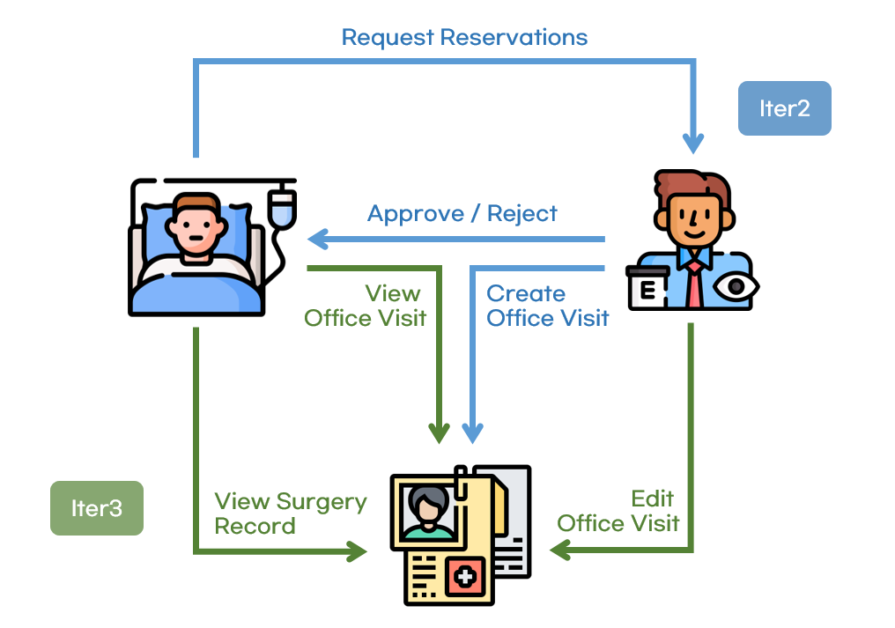

# Team1 Meeting Log
- Team1 Member : 김영서, 박승호, 엄소은

## 목차

1. [10/28](#anchor-1028)
2. [11/5](#anchor-115)
3. [11/11](#anchor-1111)
4. [11/13](#anchor-1113)
5. [11/16](#anchor-1116)
6. [11/18](#anchor-1118)
7. [11/20](#anchor-1120)
8. [11/22](#anchor-1122)
9. [11/24](#anchor-1124)
10. [12/1](#anchor-121)
11. [12/7](#anchor-127)
12. [12/11](#anchor-1211)

## UC Flow

## 회의록

### 10/28
- Before Meeting
    - Use Case 모두 읽어보기 
- During Meeting
    - 안과와 관련된 UC 2개 (UC 21, 22) 선정

### 11/5
- Before Meeting
    - DB 칼럼 뜯어보기
    - UC 별로 API 명세 작성
- During Meeting
    - 브랜치 관리 : 메인 개발은 feature/team1, 각 UC 별로 새로운 브랜치에 개발
    - API 명세 별로 만들어야 하는 기능 확정

    

    - 구현해야 하는 기능 분담
        - Iter1 : 0~6 끝내기 (BE- 엄소은, 박승호, FE - 김영서, 박승호) 

### 11/11
- Before Meeting
    - 개발 관련 오류 발생한 것 가져오기
- During Meeting
    - iTrust2 에 이미 구현되어 있는 기능 / 구현해야 할 기능 세부적으로 나누기

    

- 개발 상황
    - [X] (FE) 안과 약속 조회 하는 페이지
    - [X] (FE) eyecheckup 체크 하는 박스
    - [X] (BE) OPH, OD 도 appointment 를 볼 수 있도록 권한 추가 부여

### 11/13
- Before Meeting
    - HCP, OD, OPH 권한 별로 안과 수술 신청 권한이 다른 것을 확인
- During Meeting
    - BE에서 설정한 권한 대로 FE 에서도 안보이게 맞추기 
- 개발 상황
    - [X] (FE) HCP 에서 view opth request 문구 없애기
    - [X] (FE) HCP 에서 일반 안과 약속 볼 수 있는 페이지 삭제 
    - [X]  (FE) 환자가 안과약속 신청할 때 OD, OPH 에게만 신청할 수 있도록 변경
- 브랜치 이슈
    - develop 말고 main 에 머지하는 이슈 -> revert 로 해결 

### 11/16
- Before Meeting
    - edit office visit page 구현
        - oph role을 가진 user는 자신이 기록한/만든 office visit의 명단을 볼 수 있다.(role에 대한 update 필요, 명단 가져오는 api는 있음 get; api/v1/officevisits/hcp)
        - edit an office visit 버튼을 통해 edit document office visit page로 이동할 수 있다. (라우팅 필요)
        - create a new office visit 버튼을 통해 document office visit page로 이동할 수 있다. (라우팅 필요)

    - edit document office visit page 구현
        - document랑 비슷하게 생긴 페이지, 정보가 전부 입력되어 있음(세부 정보 가져오는 api 있는 거 같은데 확인 필요 get; api/v1/officevisits/{id}
        - 업데이트 api는 있음: put; api/v1/officevisits/{id}
        - 버튼 수정: Update Office Visit

    - past office visit page 구현
        - 환자가 자신이 방문했던 office visit 명단을 type에 따라 label하여 볼 수 있다.(명단 가져오는 api 있음: get; api/v1/officevisits/myofficevisits)
        - 그중 surgery office visit 하나를 선택하여 view an ophthalmology surgery visit 페이지로 이동할 수 있다. (라우팅 필요)

    - view an ophthalmology surgery visit 페이지 구현
        - 해당 office visit의 날짜, 시력 정보, sphere, cylinder, axis, surgery type, notes를 볼 수 있다. 수정x(api 없음, 구현 필요)

- During Meeting
    - Eyecheckup 개발 상황 공유

- 개발 상황
    - [X] (BE) eyecheckup 관련 테이블 추가
    - [X] (BE) eyecheckup id 을 OfficeVisit 테이블에서 FK 로 참조하도록 추가 

### 11/18
- During Meeting 
    - FE, BE eyecheckup 관련 형식 맞추기 

    

    

- 개발 상황
    - [X] 프런트에서 eyecheckup 입력하면 DB 에 저장되는 것 확인
    - [X] edit office visit 시 수정된 정보가 DB 에 저장되는 것 확인
- 개발 이슈 
    - 이클립스에서 폴더명이 대문자만 빌드가 되어서 머지 시 폴더명을 바꿔서 버그가 생기는 이슈
    - GitKaraken 에서 commit 을 보면서 해결
    - 전체 회의를 통해 폴더명 통일

    

### 11/20
- Before Meeting
    - UC 21 정상 작동하는지 확인 
    - API 테스트 시 오는 형식 확인 

    

- During Meeting 
    - API 테스트 시 오는 형식 확인 

- 개발 상황
    - [X] UC 21 FE, BE 구현 완료

- 개발 이슈
    - Postman 에서 권한 때문에 계속 401 Unauthorized 오류가 나서 API 테스트를 할 수 없는 문제 발생
    - 팀 톡방 공유 후 전체 톡방에서 문제 공유해서 해결

    

    

### 11/22 
- During Meeting
    - 구현 계획 (프론트엔드)
        - past office visit 페이지 구현 : 환자_office visits 명단 확인 (get_api/v1/officevisits/myofficevisits)
        - view an ophthalmology surgery visit 페이지 구현 : 환자_수술 정보 확인 (api 구현 필요)

    - 구현 계획 (백엔드)
        - surgeryType 저장할 디비 자동 생성
        - surgeryType도 같이 저장하도록 수정 (post_officevisit/hcp)
        - eyecheckup 여부 및 type이 수술일 시 surgeryType도 같이 가져오게 수정 (get_officevisits/hcp)
        - eyecheckup 여부 및 정보, type이 수술일 시 surgeryType도 같이 가져오게 수정 (get_officevisits/{id})
        - eyecheckup 정보 및 type이 수술일 시 surgeryType도 같이 수정할 수 있게 수정 (put_officevisits/{id})

    - 백엔드 역할 분담
        - 엄소은
            - eyecheckup, surgerytype 관련 기존 테스트 코드 수정
            - surgeryType 관련 기존 api 수정
            - editOfficeVisit(put_officevisits/{id}) 테스트 코드 제작
            - api document
        - 박승호
            - 수술 세부 정보 api 제작
            - 제작한 api 테스트 코드 제작
            - 프론트 도움 

- 개발 이슈
    - feature/team1 에서는 기능이 정상 작동하지만, develop 브랜치에서 정상 작동 되지 않는 문제 발생
    - 다른 팀의 머지 시 team1 의 코드가 날라가는 문제가 발생했음을 확인했고, 수정 완료함

### 11/24
- Before Meeting
    - FE 관련 문제 상황 인식 
- During Meeting
    - 프런트 페이지에서 General Opthalamology 체크 시 아무것도 안나타는 문제 수정 

#121
### 12/1 
- During Meeting
    - FE , BE 개발 상황 공유

- 개발 상황
    - [X] (FE)  past office visit 라우팅 연결하고 내용 넣기 
    - [X] (FE) document office visit에서 diagnoses 뜨는 디버깅도 완료했고 viewSurgeryDetail page도 만듦
    - [X] (BE) SurgeryType Enum 만들고 officeVisit 에 코드 형식으로 저장 
    - [X] (BE) patient가 surgeryvisit 볼 수 있는 api 만들고 logger 부분 visit type에 따라 다르게 찍히도록 수정
    - [X] (BE) prescriptions 정보도 editOfficeVisit page에서 나오도록 수정했고 patient surgeryVisit 잘 가져오는 것도 확인

### 12/7
- During Meeting
    - 테스트 코드 관련 문제 상황 공유

- 개발 상황
    - [X] OfficeVisit API 테스트 커버리지 88% 확인 

- 개발 이슈
    - 무결성 조건으로 인해 삭제시 오류가 발생하는 것 확인, DB 내용 초기화 후 다시 작업
    
    

### 12/11
- During Meeting
    - 머지 이후 UC21, 22에 대한 front-end test 및 핫픽스
    - documentation update