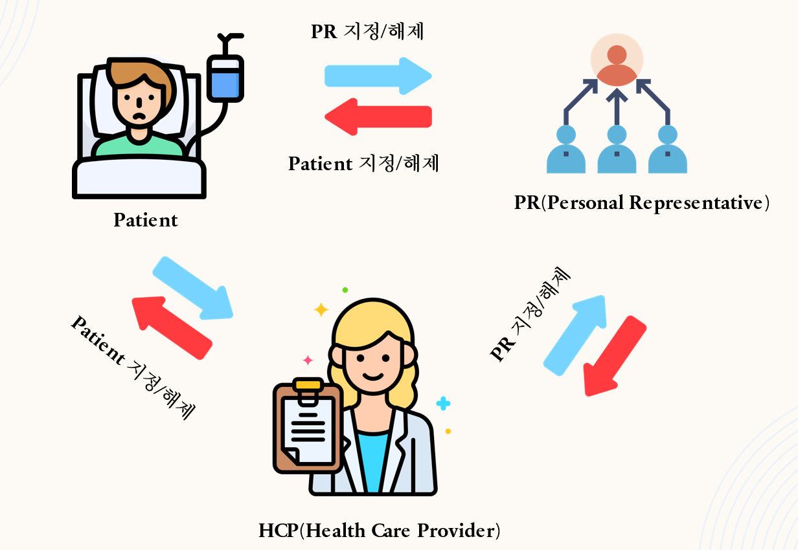

# Team2 Meeting Log
- Team2 Member : 김주은, 윤종윤, 장영환

## 목차

1. [10/30](#anchor-1030)
2. [11/4](#anchor-114)
3. [11/9](#anchor-119)
4. [11/13](#anchor-1113)
5. [11/15](#anchor-1115)
6. [11/18](#anchor-1118)
7. [11/20](#anchor-1120)
8. [11/24](#anchor-1124)
9. [11/29](#anchor-1129)
10. [12/3](#anchor-123)
11. [12/5](#anchor-125)
12. [12/8](#anchor-128)

## UC Flow

## 회의록

### 10/30
- Before Meeting
    - Use Case 모두 읽기
    - UserCase 선정 (UC 16, 19)
    - User Story 작성
- During Meeting
    - 포지션 분배(Front: 김주은, 장영환 Back: 윤종윤)
    - 대략적인 개발 계획 작성
      - 2팀 개발 계획
      - Iter1: UC 15, 16, 19 User Story 작성, UC 16 기능 명세 작성
      - Iter2: UC 16 구현, JUnit TestCode 작성, UC 19 기능 명세 작성
      - Iter3: UC 19 구현, JUnit TestCode 작성, UC 16, 19 JUnit Test Coverage 80%

---

### 11/4
- Before Meeting
    - 기존 코드 숙지
- During Meeting
    - Git Flow 방식 제안
    - 포지션 재분배(Front: 김주은, ~~장영환~~ Back: 윤종윤, 장영환)

---

### 11/9
- Before Meeting
    - TODO 생각해보기
- During Meeting
    - API 명세 작성
  
    - 개발 계획 브리핑
- 이슈
    - HCP와 Patient가 공통으로 사용하는 기능 API 통합 여부

---

### 11/13
- Before Meeting
    - Spring Boot, Angular JS Study
- During Meeting
    - BE에서 설정한 권한 대로 FE 에서도 안보이게 맞추기
- 개발 상황
    - [X] (FE) Patient의 Add Food Diary 페이지 구현
- 개발 이슈
    - Build가 안되는 문제
      
    - 해결방안 제시
      
    - 실패...

### 11/15
- Before Meeting
    - Build가 안되는 이슈 해결할 것
- During Meeting
    - Build 이슈 해결
      
    - application.yml수정
      

- 개발 상황
    - [X] (FE) 네비게이션 바에 FoodDiary 추가

---

### 11/18
- Before Meeting
  - (BE) API 분담
- During Meeting
    - API 기능 추가 설명
    - HCP와 Patient의 Food Diary View API 통합
    - (BE) Spring Boot Architecture 스터디
    - (BE) Postman 스터디
- 개발 상황
    - [X] 프런트에서 eyecheckup 입력하면 DB 에 저장되는 것 확인
    - [X] edit office visit 시 수정된 정보가 DB 에 저장되는 것 확인
- 개발 이슈
    - Food Diary의 Date 자료형 처리 문제
    - patients API GET이 안되는 문제

---

### 11/20
- Before Meeting
    - FoodDiary API 개발 완료(목표)
    - FoodDiary FE 개발 완료(목표)
    - API Document 작성
      
- During Meeting
    - (FE) Food Diary View 방식 제안
    - UserID가 DB에 저장이 안되는 문제 해결
    - Iter2 발표 PPT 제작

- 개발 상황
    - [X] UC 19 FE, BE 구현 완료

- 개발 이슈
    - FoodDiary ID, UserID 혼동 문제 => 해결
    - AddFoodDiary API에서 UserID가 DB에 저장이 안되는 문제 => Team3 BackEnd 팀원의 도움을 받아 해결
      
    - Date 자료형 문제 => String으로 통일
    - AddFoodDiary 400ERROR => 해결(오타 수정)
---

### 11/24
- During Meeting
    - 백엔드 역할 분담
        - 윤종윤
            - FoodDiary TestCode 작성
            - BackEnd 지원
            - 회의록 정리
        - 장영환
            - API Document 작성
            - PR API (UC16) 작성
            - FoodDiary TestCode 작성
---

### 11/29
- Before Meeting
    - Swagger 스커디
    - API Document 작성
      
- During Meeting
    - (BE) API 개발 도중 생긴 이슈 공유
    - UC16 기능 파악
      
- 개발 상황
  - [X] (BE) Assignor PR 지정 API 구현 (API 1-1)
  - [X] (BE) Assignee PR 지정 API 구현 (API 1-2)
  - [X] (BE) Assignor Assignee 확인 API 구현 (API 2-1)
  - [X] (BE) Assignee Assignor 확인 API 구현(API 2-2)
  - [X] (BE) Assignee Assignor PR관계 해제 API 구현 (API 3)
  - [X] (BE) HCP PR관계 확인 API 구현 (API 3)

---

### 12/3
- During Meeting
    - FE, BE 개발 상황 공유
    - 개발 도중 생긴 이슈 공유

- 개발 상황
    - [X] (FE) Patient PR 지정 페이지 구현
    - [X] (FE) Patient PR 조회 페이지 구현
- 개발 이슈
  
  - 오타 수정 => 해결
  - PR 관계 지정을 위한 Patient List를 조회 할 때 자신까지 보이는 문제
  - 이미 PR 관계인 사람이 Patient List에 뜨는 문제(중복)
  - 이미 PR 관계가 있는 사람들이 제약 없이 PR assign 할 수 있는 문제(중복)
---

### 12/5
- During Meeting
    - 개발 도중 생긴 이슈 공유
    - 개발 도중 생긴 이슈 해결

- 개발 상황
    - [X] (FE) HCP PR 지정 페이지 구현
    - [X] (FE) HCP PR 조회 페이지 구현

- 개발 이슈
    - release assignor, assignee API가 작동 안하는 문제 => 해결
    - HCP PR 관계 View가 안되는 문제 => 해결
---

### 12/8
- Before Meeting
    - Test Coverage 80% 이상 달성
      
      
- During Meeting
  - 개발 도중 생긴 이슈 공유
  - 개발 도중 생긴 이슈 해결

- 개발 이슈
  
- Food Diary TestCode에서 POST가 안되는 문제 => 해결
---

